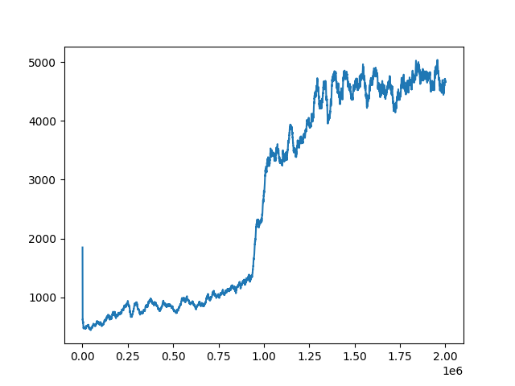
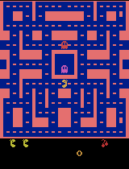

# DQN_pacman
This project implements training and evaluation of Deep Q-Networks (DQN) and ResNet-DQNs on the Ms. Pacman environment using PyTorch. The training involves experience replay, epsilon-greedy exploration, and target network updates.

## Project Structure
* `utils/environment.py`: Contains the CustomMsPacmanEnv class for interacting with the Ms. Pacman environment.
* `utils/wrappers.py`: Contains environment wrappers (MaxAndSkipEnv, ProcessFrame84Gray, BufferWrapper) for preprocessing the environment observations.
* `utils/agent.py`: Contains the Agent class responsible for playing steps in the environment and storing experiences in the replay buffer.
* `utils/replay_buffer.py`: Contains the ExperienceBuffer class for storing and sampling experiences.
* `utils/loss.py`: Contains the calc_loss function for computing the loss during training.
*  `models/dqn_model.py`: Contains the implementation of the DQN model.
* `models/resnet_dqn_model.py`: Contains the implementation of the ResNet-DQN model.
* `train.py`: Main script for training the models.
* `eval.py`: Script for evaluating the trained models and saving the gameplay as GIFs.

### Installation
1. Clone the repository:
```bash 
git clone https://github.com/Harsha-madyastha/DQN_pacman
```
```bash 
cd ms-pacman-dqn
```
2. Install the required Python packages:

```bash
pip install -r requirements.txt
```
3. Make sure you have the Ms. Pacman ROM file (ms_pacman.bin) in the root directory.

## Usage
### Training

To train a model, use the `train.py` script. You can choose between the DQN and ResNet-DQN models.

```bash

python train.py --model resnet
```

#### Arguments
* --model: Model to train, choices are DQN or resnet. Default is resnet.

### Evaluation

To evaluate a model and generate a GIF of the gameplay, use the `eval.py` script.

```bash

python eval.py
```

The script evaluates all models with different batch sizes (32, 64, 128) for both DQN and ResNet-DQN.

## Results

The training script will save the best model weights in the current directory, and the evaluation script will generate a GIF animation of the agent playing Ms. Pacman.

#### Models and Training
Two models were trained: Deep Q-Network (DQN) and ResNet DQN. Both models were trained with batch sizes of 32, 64, and 128.

#### Analysis
From the frames vs. reward plots, it is evident that the models failed to learn effectively over time. This resulted in poor performance during evaluation. The reward plots show significant fluctuations and a lack of steady improvement, indicating that the models struggled to converge and learn an optimal policy.

However, out of the tried models and batch sizes, the **batch_size:32** trained with **DQN** showed an improvement in learning. This model demonstrated that the agent learned from the environment, achieving the highest score in evaluation compared to the rest.


*Frames vs reward plot for DQN model with batch-size:32*


*Pacman game play animation*

### Future Work
To improve the performance of the models, several approaches can be considered:
* Fine-tuning hyperparameters
* Increasing the complexity of the models
* Incorporating advanced techniques such as Double DQN or Dueling DQN
* Utilizing more sophisticated training algorithms and optimizers
* Exploring different reward structures and environment settings

### References

Parts of this project were inspired by and adapted from [Marzio Sala's Ms. Pacman DQN implementation](https://marziosala.github.io/ms-pacman/).
